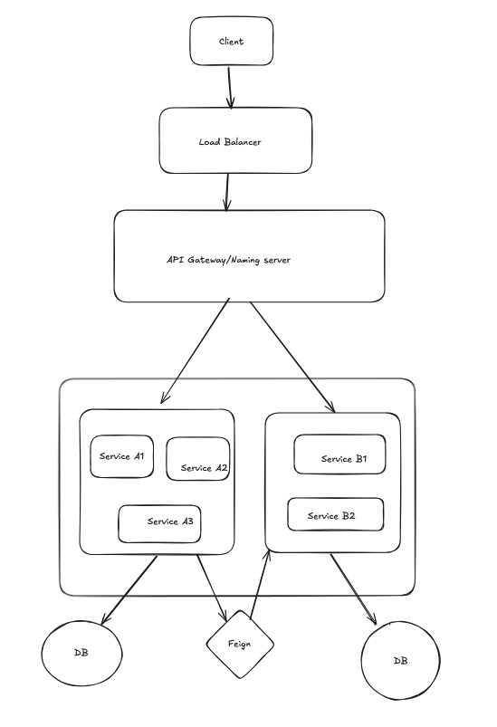
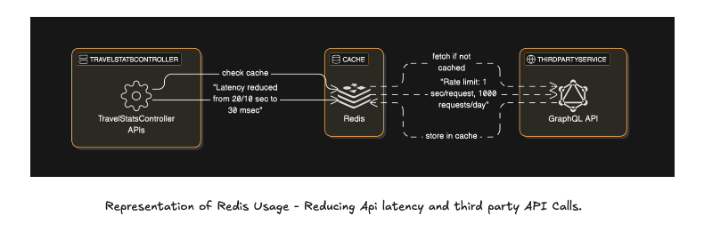
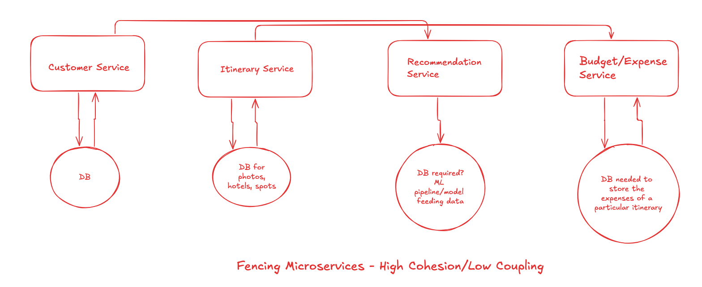
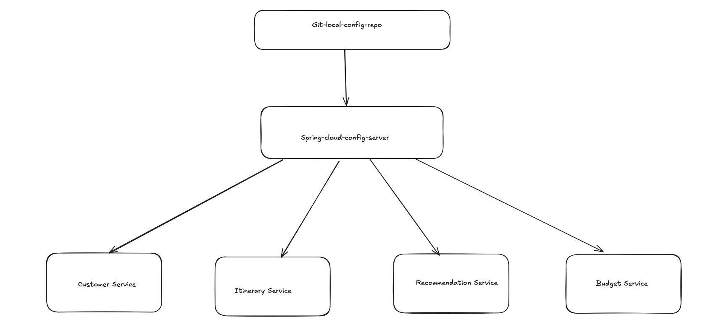

# Travelopedia 🌍✈️

A comprehensive web application for backpackers and travelers to plan, document, optimize and look for their travel-stats!

[Visit Live Site](https://travelopedia-v1.vercel.app/)


# Embedded Google Drive Video

[View the video on Google Drive](https://drive.google.com/file/d/17uzdlhhE1vQ5ZfkZ8RFu0jfGQIyaZr9y/preview)

<p align="center">
  
  
  
  
  
  
</p>

<p align="center">
  
  
  
  
</p>

## 🌟 Features

### 📊 Travel Statistics

- Track visited destinations
- View global travel statistics and rankings
- Visualize travelled checkpoints and store wishlists

### 🎯 Smart Recommendations

- AI/ML-powered itinerary suggestions
- Personalized travel recommendations
- Generate customized itineraries amd talk with a chatbot to improve that itinerary
- Save the itineraries to log trip and edit them, or view them again next time.

### 📝 Travel Documentation

- Document hotels, restaurants, and tourist spots
- Create detailed day-wise trip breakdowns
- Share travel experiences and tips
- Manage long-term travel plans

### 💰 Budget Management

- Predict trip expenses
- Optimize travel costs
- Track accommodation and ticket prices

## 🏗️ Architecture

### Microservices Overview

The application follows a microservices architecture with high cohesion and low coupling:

1. **Customer Service**

   - User profiles and authentication
   - Wishlist management
   - Travel history tracking
   - JWT-based security

2. **Recommendation Service**

   - AI/ML-based suggestions
   - Personalized travel recommendations
   - Save and log user chats
   - make better itinerary suggestions based on user's current chat.

3. **Budget/Expense Service**
   - Cost prediction
   - Expense tracking
   - Budget optimization
   - Daily activity planning
   - Location documentation
   - Trip scheduling
   - Trip Logging

### Technical Stack

#### Backend

- Java/Spring Boot for microservices
- Spring Cloud for service configuration
- Redis (35MB free tier) for high-speed caching
- MySQL for general-purpose database
- API Gateway for request routing
- Load Balancer for traffic distribution

#### Frontend

- React with Context API
- Modern responsive design
- Jest for testing and development
- Interactive user interface

#### DevOps

- Docker containerization
- Kubernetes orchestration
- YAML configuration

## 🔄 System Flow



1. Client requests are distributed through a Load Balancer
2. Requests are routed through the API Gateway
3. Services communicate using Feign clients
4. Redis caching reduces API latency
5. Each service maintains its dedicated database
6. Spring Cloud Config Server manages service configurations

## 💻 Performance Optimization



- Redis caching reduces API latency from 20/10 sec to 30 msec
- Rate limiting: 1000 requests/day
- GraphQL API for efficient data fetching
- Microservices ensure scalability and maintainability

## 🔐 Security

- JWT-based authentication
- Secure API endpoints
- Role-based access control
- Environment-based configuration

## 📸 Live Application Screenshots

### Landing Page


_Beautiful landing page featuring hot air balloons over a scenic landscape_

### Architecture Diagrams





## 🚀 Getting Started

```bash
# Clone the repository
git clone https://github.com/1709abhishek/travelopedia.git

# Navigate to the project directory
cd travelopedia

cd client

# Install dependencies
npm install

# Start the development server
npm run dev
```

```bash
#start backend
# Clone the repository
git clone https://github.com/1709abhishek/travelopedia.git

# Navigate to the project directory
cd travelopedia

# enter into server
cd server

#start customer-service
cd customer service
mvn spring-boot:run

#start recommendation-service
cd recommendation-service
mvn spring-boot:run

#start budget service
cd budget-service
mvn spring-boot:run
```
